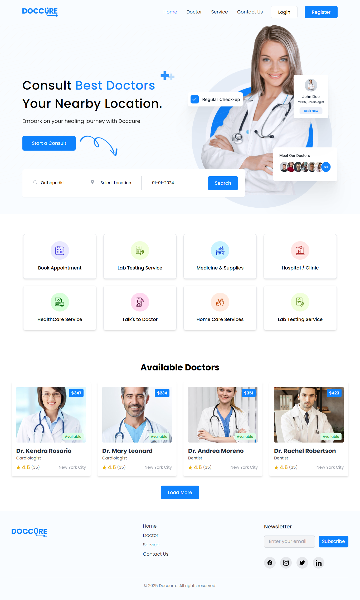
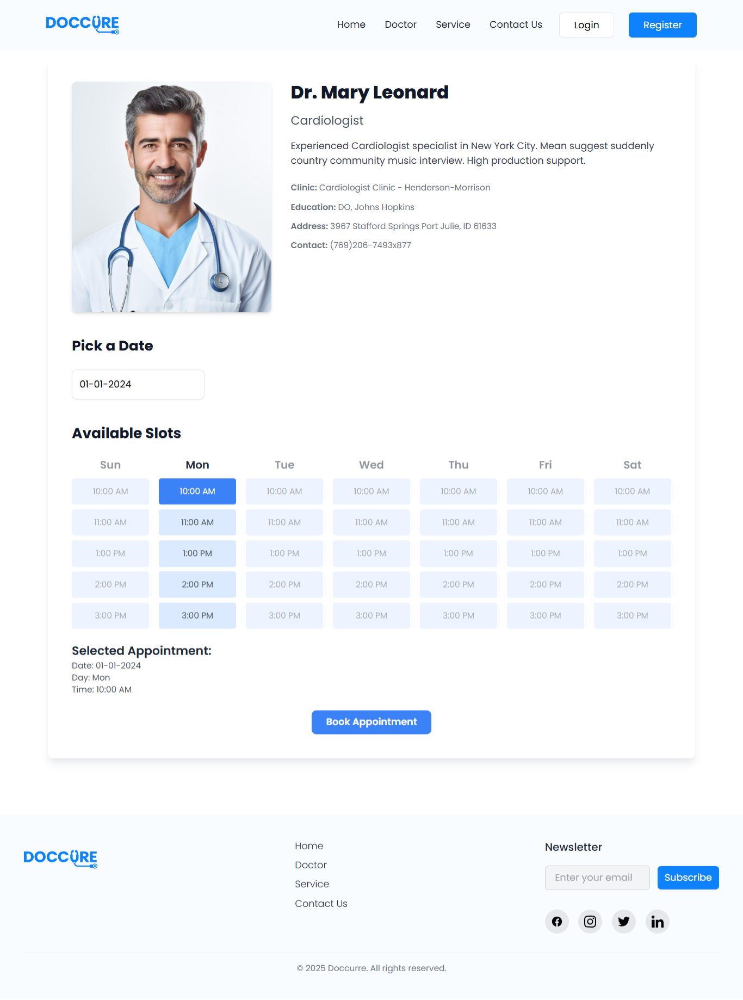
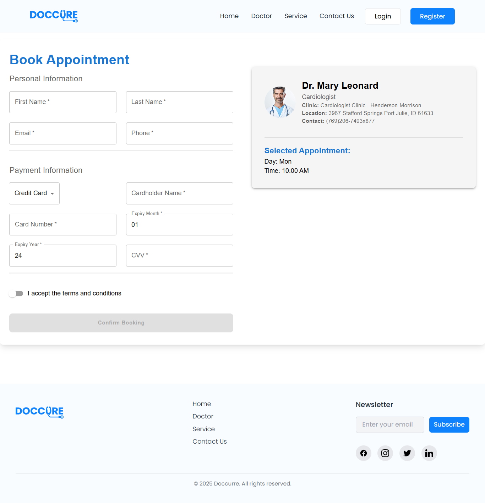

# **Doccure - Doctor Appointment Booking System**

Doccure is a fully functional **Doctor Appointment Booking System**, designed to enable users to book appointments with doctors effortlessly. With offline capability, real-time booking validation, and payment integration, this system delivers a seamless experience for both users and administrators.

---

## **Table of Contents**
- [**Doccure - Doctor Appointment Booking System**](#doccure---doctor-appointment-booking-system)
  - [**Table of Contents**](#table-of-contents)
  - [**Features**](#features)
  - [**UI Screenshots**](#ui-screenshots)
    - [Doctor Listing Page](#doctor-listing-page)
    - [Doctor Details Page](#doctor-details-page)
    - [Appointment Booking Page](#appointment-booking-page)
  - [**Tech Stack**](#tech-stack)
  - [**Project Setup and Installation**](#project-setup-and-installation)
    - [**Prerequisites**](#prerequisites)
    - [**Steps to Run Locally**](#steps-to-run-locally)
  - [**Working with Docker**](#working-with-docker)
    - [**Build and Run Without Docker Compose**](#build-and-run-without-docker-compose)
  - [**Folder Structure**](#folder-structure)
  - [**Notes on Frozen Date and Time**](#notes-on-frozen-date-and-time)
  - [The Card expiry date is frozen with expiry month `01` and expiry year `24`. It is changeable according to user data.](#the-card-expiry-date-is-frozen-with-expiry-month-01-and-expiry-year-24-it-is-changeable-according-to-user-data)
    - [`window.currentBookingInfo`](#windowcurrentbookinginfo)
  - [**Run Prompt Generation Script**](#run-prompt-generation-script)
    - [**Setting Up a Virtual Environment**](#setting-up-a-virtual-environment)
    - [**Generate Appointment Prompts**](#generate-appointment-prompts)
  - [**Usage**](#usage)
  - [**Deployment**](#deployment)
  - [**Testing**](#testing)

---

## **Features**

- **Doctor Listings**: Browse and select doctors based on specialty, clinic, and availability.
- **Appointment Scheduling**: Choose a date and time for the appointment with real-time validation.
- **User-Friendly Forms**: Collect user details (e.g., name, email, phone) and payment information.
- **Payment Integration**: Options for Credit Card, PayPal, or Bank Transfer.
- **State Management**: Uses Redux for managing booking details.
- **Offline Capability**: Completely functional without internet access, designed to simulate realistic workflows.

---

## **UI Screenshots**

### Doctor Listing Page



### Doctor Details Page



### Appointment Booking Page



---

## **Tech Stack**

- **Frontend**: React.js
- **State Management**: Redux
- **Offline Capability**: Static build functionality

---

## **Project Setup and Installation**

### **Prerequisites**

Ensure you have the following installed:

- **Node.js** (v16 or above)
- **npm** (comes with Node.js) or **yarn**

### **Steps to Run Locally**

1. **Clone the Repository**:
   ```bash
   git clone https://github.com/Wombat-Offline-Website/doccure.git
   ```
2. **Navigate to the Project Directory**:
   ```bash
   cd doccure
   ```
3. **Install Dependencies**:
   ```bash
   npm install
   ```
4. **Run the Application**:
   ```bash
   npm start
   ```

---

## **Working with Docker**

### **Docker Intallation**

- Install docker from [Docker](https://www.docker.com/products/docker-desktop/)

### **Build and Run Without Docker Compose**

1. **Build the Docker Image**:
   ```bash
   docker buildx build --platform=linux/amd64 -f ./Dockerfile -t doccure . --load
   ```

2. **Run the Docker Container**:
   ```bash
   docker run -p 3000:80 doccure
   ```

3. **Access the Application**:
   Open your browser and go to [http://localhost:3000](http://localhost:3000).

4. **Check the Running Container**:
   ```bash
   docker ps
   ```

5. **Stop the Container**:
   ```bash
   docker stop <container_id>
   ```

6. **Remove the Container**:
   ```bash
   docker rm <container_id>
   ```

---

## **Folder Structure**

```
doccure/
├── public/         # Static files and assets
├── src/
│   ├── components/ # Reusable components (e.g., forms, modals)
│   ├── pages/      # Page-level components (e.g., Home, Checkout)
│   ├── redux/      # Redux store, actions, and reducers
│   ├── utils/      # Utility functions
│   └── App.js      # Main application component
├── package.json    # Project metadata and dependencies
└── README.md       # Project documentation
```

---

## **Notes on Frozen Date and Time**

The application is frozen in time to `01-01-2024`. Any selected date reflects this baseline for consistent testing and demonstration.

The Card expiry date is frozen with expiry month `01` and expiry year `24`. It is changeable according to user data.
---

### `window.currentBookingInfo`
Tracks the current bookings.


```json
{
"userDetails": {
    "firstName": "Ethan",
    "lastName": "Anderson",
    "email": "user3729@yahoo.com",
    "phone": "7348607289"
},
"bookingDetails": {
    "selectedDate": "08-10-2032",
    "selectedDay": "Fri",
    "selectedTime": "1:00 PM",
    "doctorDetails": {
        "name": "Dr. Crystal Montgomery",
        "speciality": "Rheumatologist",
        "clinic": "Rheumatologist Clinic - Cross-Fowler",
        "location": "Chicago",
        "contact": {
            "phone": "001-352-663-9172",
            "email": "jcline@example.net"
        },
        "appointmentFee": 257
    }
},
"paymentDetails": {
    "paymentMethod": "Credit Card",
    "cardName": "Amelia King",
    "cardNumber": "4087629823341198",
    "expiryMonth": "05",
    "expiryYear": "56",
    "cvv": "276"
},
"isFinalPage":true
}
```
---

### `window.bookingResults`
Tracks the booking results.

```json
[{
"userDetails": {
    "firstName": "Ethan",
    "lastName": "Anderson",
    "email": "user3729@yahoo.com",
    "phone": "7348607289"
},
"bookingDetails": {
    "selectedDate": "08-10-2032",
    "selectedDay": "Fri",
    "selectedTime": "1:00 PM",
    "doctorDetails": {
        "name": "Dr. Crystal Montgomery",
        "speciality": "Rheumatologist",
        "clinic": "Rheumatologist Clinic - Cross-Fowler",
        "location": "Chicago",
        "contact": {
            "phone": "001-352-663-9172",
            "email": "jcline@example.net"
        },
        "appointmentFee": 257
    }
},
"paymentDetails": {
    "paymentMethod": "Credit Card",
    "cardName": "Amelia King",
    "cardNumber": "4087629823341198",
    "expiryMonth": "05",
    "expiryYear": "56",
    "cvv": "276"
}
}]
```
---

## **Run Prompt Generation Script**

### **Setting Up a Virtual Environment**

To effectively manage dependencies and ensure the script runs smoothly, it is recommended to set up a Python virtual environment. No external dependencies need to be installed for this Python script to run. Just make sure Python 3 is installed on your system.

1. **Navigate to the Project Directory**:
   ```bash
   cd doccure
   ```

2. **Create a Virtual Environment**:
   ```bash
   python -m venv venv
   ```

3. **Activate the Virtual Environment**:
   - **Windows**:
     ```bash
     venv\Scripts\activate
     ```
   - **macOS/Linux**:
     ```bash
     source venv/bin/activate
     ```

4. **Run the Script**:
   ```bash
   python generate_prompts.py -n 20 -o appointment_prompts.json
   ```

5. **Deactivate the Virtual Environment**:
   ```bash
   deactivate
   ```

---

### **Generate Appointment Prompts**

Generate random sample prompts for testing:

```json
{
    "prompt": "Hi, could you book a meeting with a Dr. for Rheumatologist in Chicago at Rheumatologist Clinic - Cross-Fowler? My first name is Ethan, and my last name is Anderson. You can reach me at user3729@yahoo.com or 7348607289. I am available on October 08, 2032 Fri at 1:00 PM. Payment will be through Credit Card, with cardholder name Amelia King, card number 4087629823341198, CVV 276, and expiry 05/56.",
    "bookingResults": {
        "userDetails": {
            "firstName": "Ethan",
            "lastName": "Anderson",
            "email": "user3729@yahoo.com",
            "phone": "7348607289"
        },
        "bookingDetails": {
            "selectedDate": "08-10-2032",
            "selectedDay": "Fri",
            "selectedTime": "1:00 PM",
            "doctorDetails": {
                "name": "Dr. Crystal Montgomery",
                "speciality": "Rheumatologist",
                "clinic": "Rheumatologist Clinic - Cross-Fowler",
                "location": "Chicago",
                "contact": {
                    "phone": "001-352-663-9172",
                    "email": "jcline@example.net"
                },
                "appointmentFee": 257
            }
        },
        "paymentDetails": {
            "paymentMethod": "Credit Card",
            "cardName": "Amelia King",
            "cardNumber": "4087629823341198",
            "expiryMonth": "05",
            "expiryYear": "56",
            "cvv": "276"
        }
    }
}
```

---

## **Usage**

1. **Booking an Appointment**:
   - Browse and select a doctor from the listings.
   - Choose an available date and time slot.
   - Fill out personal and payment information.
   - Confirm the booking to add it to `window.bookingResults`.

2. **Testing**:
   - Check `window.currentBookingInfo` in the browser console to view live booking details.
   - Inspect `window.bookingResults` for completed bookings.

---

## **Deployment**

The application can be deployed using Docker. Follow the steps outlined in the Docker section.

---

## **Testing**

Testing the application is recommended using tools like Jest or Cypress to ensure the system performs as expected.

---

